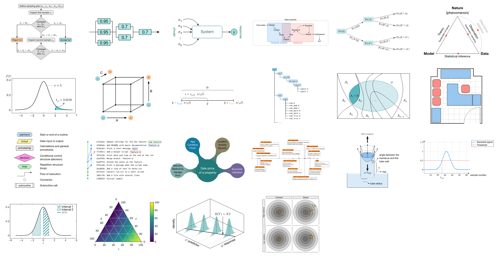

# CeTZ Gallery

[View as PDF](https://romeov.github.io/CeTZGallery/cetz-gallery.pdf). [View as HTML](https://romeov.github.io/CeTZGallery/).

See also [Visual CeTZ](https://romeov.github.io/VisualCeTZ/), one picture per CeTZ command or parameter.

Ten diagrams in idiomatic [CeTZ](https://cetz-package.github.io/) 0.5.2, the drawing package for [Typst](https://typst.app/), each chosen for a technique worth copying: relative placement, elbow and curved connectors, forks and joins, group frames, trees, braces, mid-path arrows, plots in data units, and an oblique 3D view.

Every figure is a CeTZ redrawing of a TikZ figure from Walmes M. Zeviani's [_Tikz Gallery_](https://github.com/walmes/Tikz) ([site](http://leg.ufpr.br/~walmes/Tikz/)).
Each entry links its original. The originals remain his work and are not copied into this repository.
The redrawings translate the labels from Portuguese to English, use Typst's built-in colors, and differ in detail.



Each figure is a standalone file in [`figures/`](figures/). The page shows every render next to its full source.

## Build

With Typst 0.15 or later:

```sh
./build.sh
```

This writes `docs/cetz-gallery.pdf` and `docs/index.html`, which GitHub Pages serves. The HTML export uses Typst's experimental `html` feature.

## License

MIT for the CeTZ code in this repository; see [LICENSE](LICENSE). This does not cover the original TikZ figures, which are not included here.
